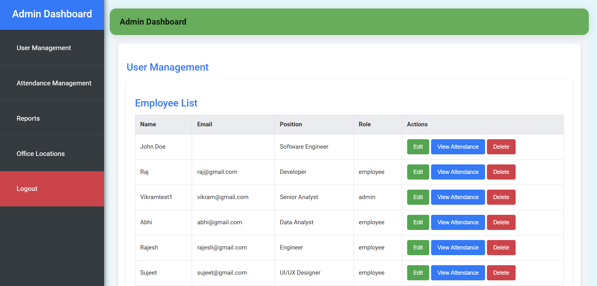
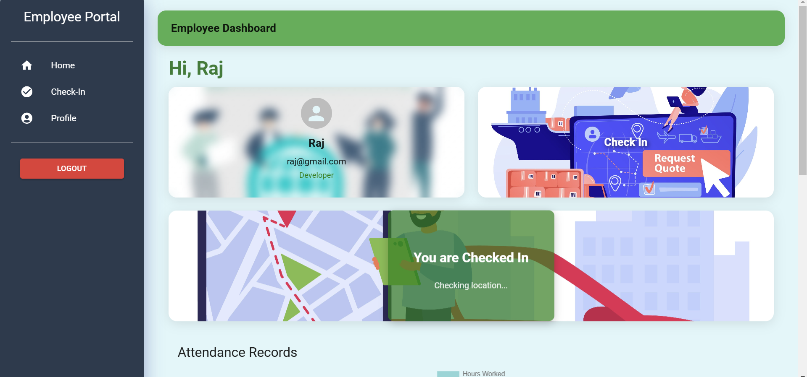

# Geolocation Attendance Management Application (GAMA)

GAMA is a comprehensive web-based solution designed to manage attendance efficiently using geolocation tracking. It offers an intuitive admin dashboard, employee self-service features, and robust reporting capabilities to streamline organizational attendance management. Built with modern web technologies, GAMA ensures secure, accurate, and real-time attendance tracking for businesses of all sizes.
## Features

### **Admin Features**:
- **User Management**: Add, update, and delete employee accounts and roles with ease.
- **Attendance Management**: View, filter, and manage employee attendance records.
- **Reports Generation**: Generate detailed attendance reports for analysis and audits.
- **Office Locations**: Define and manage office geolocation boundaries for attendance tracking.

### **Employee Features**:
- **Check-In/Check-Out**: Lock in and out securely using geolocation tracking.
- **Profile Management**: Update personal information and manage login credentials.
- **Dashboard**: View attendance history and check-in status in real-time.

### **Security & Scalability**:
- **Role-Based Access**: Separate portals for admin and employees, ensuring data security.
- **Geofencing**: Employees can only check-in from pre-defined office locations.
- **Responsive Design**: Optimized for both desktop and mobile usage.

### **System Features**:
- **SQL Database Integration**: Reliable data storage and retrieval through phpMyAdmin.
- **RESTful API**: Backend powered by secure APIs for seamless front-end communication.
- **Cross-Browser Compatibility**: Works smoothly across modern web browsers.

### **Additional Features**:
- **Login/Signup**: Secure authentication with login and account creation functionality.
- **Logout**: One-click logout to ensure secure sessions.
- **Real-Time Data Updates**: Immediate synchronization of data across all modules.
- **Interactive UI**: User-friendly design for both employees and administrators.

## Screenshots

### Admin Dashboard


### Employee Dashboard

## Getting Started

Follow these steps to set up the project on your local machine.

### **Step 1: Start XAMPP Server**
1. Download and install [XAMPP](https://www.apachefriends.org/index.html).
2. Start **Apache** and **MySQL** from the XAMPP Control Panel.
3. Open phpMyAdmin by navigating to `http://localhost/phpmyadmin` in your browser.

### **Step 2: Import Database**
1. Create a new database named `Attendance_Geolocation` in phpMyAdmin.
2. Import the `Attendance_Geolocation.sql` file located in the root of this repository.

### **Step 3: Set Up the Project**
1. Clone the repository:
   ```bash
   git clone https://github.com/Vipul1020/GAMA.git

2. Navigate to the project directory:
   ```bash
   cd GAMA

### **Step 4: Start the Backend Server**
1. Navigate to the Backend directory:
   ```bash
   cd Backend

2. Install dependencies:
   ```bash
   npm install

3. Start the backend server:
   ```bash
   nodemon server.js

### **Step 4: Start the Frontend Server**
1. Navigate to the Backend directory:
   ```bash
   cd Frontend

2. Install dependencies:
   ```bash
   npm install

3. Start the backend server:
   ```bash
   npm start  

### **Step 5: Access the Application**
1. Open your browser and navigate to http://localhost:3000 to access the app.
2. You will be redirected to the login page by default ,Login as already assigned id and passwords from the database. 
3. You can also also signup as a new user and role : admin or employee , to get hands on both the portals respectively.


## Project Structure

The project is organized into the following structure:
```
GAMA/
├── Backend/
│   ├── controllers/
│   ├── models/
│   ├── routes/
│   ├── .env
│   ├── app.js
│   └── server.js
├── Frontend/
│   ├── public/
│   ├── src/
│   │   ├── components/
│   │   │   ├── AdminSidebar.jsx
│   │   │   ├── EmployeeSidebar.jsx
│   │   │   └── Navbar.jsx , etc
│   │   ├── pages/
│   │   │   ├── LoginPage.jsx
│   │   │   ├── SignUpPage.jsx
│   │   │   └── Dashboard.jsx
│   │   ├── App.js
│   │   └── index.js
│   ├── .env
│   ├── package.json
│   └── package-lock.json
├── Attendance_Geolocation.sql
├── README.md
└── LICENSE
```
## Tech Stack


- **Frontend:** React, Material-UI, CSS
- **Backend:** Node.js, Express.js
- **Database:** MySQL, managed with phpMyAdmin
- **Geolocation API:** Used for location tracking (Haversine Formula)
- **Other Tools:** XAMPP, Axios, React Router

## Contributing

We welcome contributions to enhance the functionality of GAMA. Here's how you can get started:
1. Fork the repository.
2. Create a feature branch:
   ```
   git checkout -b feature/YourFeatureName
   ```

3. Commit your changes:
 ```
 git commit -m "Add a meaningful commit message"
 ```

4. Push to the branch:
```
git push origin feature/YourFeatureName
```

 